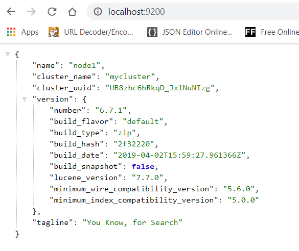
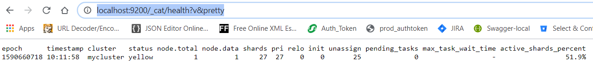

# Elastic search(ES)

- Lucene is the search library. It doesn't provide crawling and parsing capabilities for documents.
- ES is an open source search and analytics engine, written in java and built on top of lucene.
- Features
  - Distributed: Scalable to thousands of nodes.
  - High availability: Multiple copies of data are stored with in the cluster.
  - Restful API: ES provides simple REST api which can be used to perform CRUD operations, monitoring and other operations via simple JSON based http calls.
  - Powerful query DSL: Express complex queries with simple json syntax.
  - Schemaless: All the documents indexed are not required to follow any specific schema.
- Products
  - ES is developed by a company named Elastic.(https://www.elastic.co)
  - Elastic has developed various produts like Elastic search, Kibana, beats, logstash, x-pack, cloud etc.
    - Elastic Search: search and analysis engine
	- Kibana: Data visualization tool for the data present in elastic search.
	- Beats: Data agent which sends from thousands of nodes to elastic search.
	- logstash: It is a data processing(transformation) pipeline from multiple sources.
	- X-pack: Monitoring and reporting tool.
	- Cloud: ES and kibana available as a service on aws.
- Use cases
  - ES can be used to develope a e-commerce website for product catalog search, inventory and autocomplete features etc.
  - ES can be used in video hosting website for indexing titles of all videos, categories into which videos fall or tags that are associated with every video.
  - ES can be used in e-learning websites to index courses, authors and topics.
- Analysis
  - ES can be primarily used to mine log data for insights.
  - ES can be used to set price alerting platform where if the price of a product or stock falls below certain threshold to get immediate notification.
  - ES can be used to build business and analytics engine
- Intallation
  - Intallation binaries can be downloaded from elastic.co website.
  - To start ES in single node mode, execute the command elasticsearch(from the bin directory of the extracted binary)in the terminal window.
  - To start ES in cluster mode `elasticsearch -Ecluster.name=mycluster -Enode.name=node1`

Basics of ES
-
- Elastic search allows near real time(NRT) search. NRT provides low latency, ~1 second from the time a document is indexed unitl it becomes searchable.
- All nodes in ES cluster perform indexing of documents.
- All nodes in ES cluster allows search.
- Every node in ES cluster has a unique id and name.
- Every ES cluster has a unique name. The default cluster name is `elasticsearch`.
- Multiple nodes join the cluster using cluster name.
- Nodes within the same cluster must be on the same network.
- Index
  - An index is a collection of similar documents.
  - An index in a ES cluster is uniquely identified by its name.
  - An ES cluster can have any number of indices.
  - Different indices are for logical group of different types of documents.
- Document Types
  - An index in ES(prior 6.x) can have different types of documents like blog posts, blog comments of a blogging website.
  - Since ES 6.x, An index is restricted to have only one type of document.
  - Document types are user defined based on symantics.
  - All documents with the same set of fields belong to a Document type.
- Document
  - A document is the basic unit of information to be indexed that needs to be searched.
  - A document in ES expression in json format.
  - Every document is assigned to a type with in an index.  
- Shards
  - Documents in an index can be too large to fit into hard disk of one node.
  - It could be too slow to serve all search requests from one node.
  - Splitting index across multiple nodes in the cluster solves the above problems. This process is called sharding.
  - A shard contains only a subset of the index data.
- Replicas
  - To make data within cluster highly available and tolerant to node failure replication of index is required.
  - Every shard will have a corresponding replica.
  - Sharding and replicating helps in scalable search volume/throughput.
  - By default an index in ES has 5 shards and 1 replica.

Monitoring Health
-
  - URL to get health of a node is http://nodeIP:9200/ . This gives json response which describes health of the given node.
  
  

  - Exploring Health Response
    - `name` is the name of the node given when starting elasticsearch through command line.
    - `cluster_name` is the name of the cluster.
    - `cluser_uuid` is the unique id of the cluster.
	- `version` is the ES version.
	- `lucene_version` is the underlying lucene version used by ES.
  
  - URL to get health of a cluster is http://nodeIP:9200/_cat/health?v&pretty. Any nodeIP can be used to get the health of the cluster.
  
	
 
  - Exploring Cluster health response
    - `status` shows the status of the cluster.
       - `green` describes all shards and replicas are available for requests.
       - `yellow` describes cluster is functional, but some replicas may not be available. For a single node cluster, status of an index always shows yellow because it has no replicas.
       - `red` describes cluster is not functional, meaning some shards are not available.
	- `node.total` shows total no of nodes in the cluster.
	- `node.data` shows no of nodes which has data.
	- To get the what nodes are available with in the cluster currently http://nodeIP:9200/_cat/health?v&pretty.

Elastic search API
-
- ES uses REST API's to administer the cluster, perform CRUD operations, search etc.
- Http PUT is idempotant. It is used to create and update resources. 
- Http POST is not idempotant. It means we may get different results based on initial conditions. It is used only to update resources.
- Data sent to and received from server are in json format.
- CURL tool can be used to transfer data from and to a server using various protocols like http, ftp, gopher, imap, ldap etc.
  - To list all indices `curl -XGET http://localhost:9200/_cat/indices?v&pretty`.
- Creating Indices  
  - To create new index(say products) `curl -XPUT http://localhost:9200/products`.
- Adding documents to indices
  - To create a document of type `mobiles` in the index `products` with a document id (say 1), use the below command.
  `curl --location --request PUT 'http://localhost:9200/products/mobiles/1' --header 'Content-Type: application/json' --data-raw '{ 	"name":"iphone X",	"camera":"12 MP",	"storage":"256 GB",	"display":"6 inch",	"battery":"3000 mAh", "review":["Extremely happy after using it for one week"]}'`
  - Response for the above create request gives the following json response. 
  
		  {
			"_index": "products",
			"_type": "mobiles",
			"_id": "1",
			"_version": 1,
			"result": "created",
			"_shards": {
				"total": 2,
				"successful": 1,
				"failed": 0
			},
			"_seq_no": 0,
			"_primary_term": 1
		  }
  
  - To create a document with auto-generated unique id, use the below command.
  `curl --location --request PUT 'http://localhost:9200/products/mobiles/' --header 'Content-Type: application/json' --data-raw '{ 	"name":"iphone X",	"camera":"12 MP",	"storage":"256 GB",	"display":"6 inch",	"battery":"3000 mAh", "review":["Extremely happy after using it for one week"]}'`
  - Response for the above create request gave the following response.
  
		  {
			"_index": "products",
			"_type": "mobiles",
			"_id": "MZQ-W3IBCnnugUymNDxW",
			"_version": 1,
			"result": "created",
			"_shards": {
				"total": 2,
				"successful": 1,
				"failed": 0
			},
			"_seq_no": 0,
			"_primary_term": 1
		  }

- TODO:Retrieving documents from Elastic search by Id
- TODO:Retrieving whole and partial documents
- TODO:Updating whole and partial documents
- TODO:Deleting Documents and indices
- TODO:Performing Bulk operations on Documents
- TODO:Bulk Indexing of Documents from a JSON File

Query DSL
-
- ES uses Query DSL to expose most of the power of lucene through a simple json interface.
- These queries are most useful in production due to their flexibility, easier to read and debug.
- ES search works with two contexts namely Query context and Filter context.
  - Query context
    - Included or Not: Query context determines whether the document should be part of the result or not.
    - Relevance score: Calcuated for every search term the document maps to. Higher the score, more relevant the document.
  - Filter context
	- Included or Not: Works the same wasy as in Query context.
	- No scoring: No additional relevance ranking.
	- Structured data: Filter context is more suitable for exact matches, range queries(like date ranges, price ranges) etc.
	- Faster: Only determines included or not, no relevance score is calculate, hence it is faster. 
- Setup Json test data 
  - Visit https://www.json-generator.com/ to create test data.
  - The following test data template is used for generating data with 1000 documents.
  
	  [
	  '{{repeat(1000, 1000)}}',
	  {
		name:'{{firstName()}} {{surname()}}',
		age: '{{integer(18, 25)}}',
		gender: '{{gender()}}',
		email: '{{email()}}',
		phone: '+1 {{phone()}}',
		street: '{{integer(1000, 999)}} {{street()}}',
		city: '{{city()}}',
		state: '{{state()}} {{integer(100, 10000)}}'
	  }
	 ]
    
  - Click generate to generate the json and compact the json into a single line.
  - Remove the starting and ending square brackets and replace the characters },{ with }\n{ to get each seperate json documents as needed by ES.
  - Setting the index field
    - For ES to set index field to each document, document should have an additional index document for each index. i.e. `{"index":{}}`.
    - To setup index field, replace `{"name"` with `{"index": {}}\n{"name"`
	- Now the file is ready for bulk indexing. Let's save the file as test_data.json
  - To bulk index the documents by creating a new index with name `customers` and type `customer` use the below command.
  
		curl -H "Content-Type: application/x-ndjson" -XPOST "http://localhost:9200/customers/customer/_bulk?pretty&refresh" --data-binary @"test_data.json"

- Search Using Query params
  - Query Context search
    - Search terms can be passed as URL query parameters or within the URL request body.
	- Query parameters
	  - Search requests are peformed either through curl or through a browser.
	  - Examples : 
	    - To search for documents with in the customers index which contain the word `wyoming` URL is `http://localhost:9200/customers/_search?q=wyoming`.
		- Response fields
		  - `took` represents time taken to perform the search in milliseconds.
		  - `_shards` represents the no of total shards and successful or failed search counts.
		  - `hits` fields contains the important search results.
		     - `total` represents the no of total documents that match the search.
		     - `max_score` represents the max relevant score.
		     - nested `hits` field represents each document hit details.
		
			
		{
		"took": 82,
		"timed_out": false,
		"_shards": {
			"total": 5,
			"successful": 5,
			"skipped": 0,
			"failed": 0
		},
		"hits": {
			"total": 18,
			"max_score": 4.9028025,
			"hits": [
			{
				"_index": "customers",
				"_type": "customer",
				"_id": "vVIsXHIBeIe72XxDmQRZ",
				"_score": 4.9028025,
				"_source": {
					"name": "Sloan Munoz",
					"age": 24,
					"gender": "male",
					"email": "sloanmunoz@stralum.com",
					"phone": "+1 (988) 550-3781",
					"street": "1000 Garfield Place",
					"city": "Wyoming",
					"state": "Arkansas 8347"
				}
			},
			{
				"_index": "customers",
				"_type": "customer",
				"_id": "nVIsXHIBeIe72XxDmQRZ",
				"_score": 4.646152,
				"_source": {
					"name": "Bolton Roach",
					"age": 21,
					"gender": "male",
					"email": "boltonroach@stralum.com",
					"phone": "+1 (819) 421-3155",
					"street": "1000 Herkimer Court",
					"city": "Dunnavant",
					"state": "Wyoming 9077"
				}
			}]
		}
	}

        
	
	- To search for documents with search term `wyoming` and descending order of age, `http://localhost:9200/customers/_search?q=wyoming&sort=age:desc`.
		  - The response for this query will not have relevance score. Due to sorting of results relevance score no longer applies.
		- To search for documents with search term `kentucky` in `state` field `http://localhost:9200/customers/_search?q=state:kentucky&sort=age:desc`.
		- To get the subset of search results `http://localhost:9200/customers/_search?q=state:kentucky&from=10&size=2`
		  - `from` & `size` are useful for pagination.
		- `explain` query parameter gives the information about how the relevance score is calculated, which is useful for debugging purposes.
		  - `http://localhost:9200/customers/_search?q=state:kentucky&from=10&size=2&explain`

Match sub string with ngrams (yours -> yo, you, our, ours,urs)
Geo hashes for graphical search
Metaphone algorithms for phonetic match
"Did you mean" searches using Levenshtein automation

